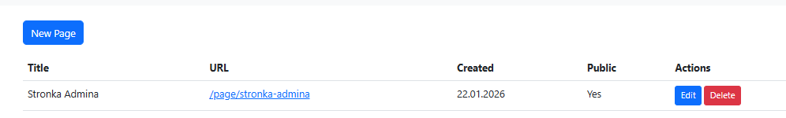
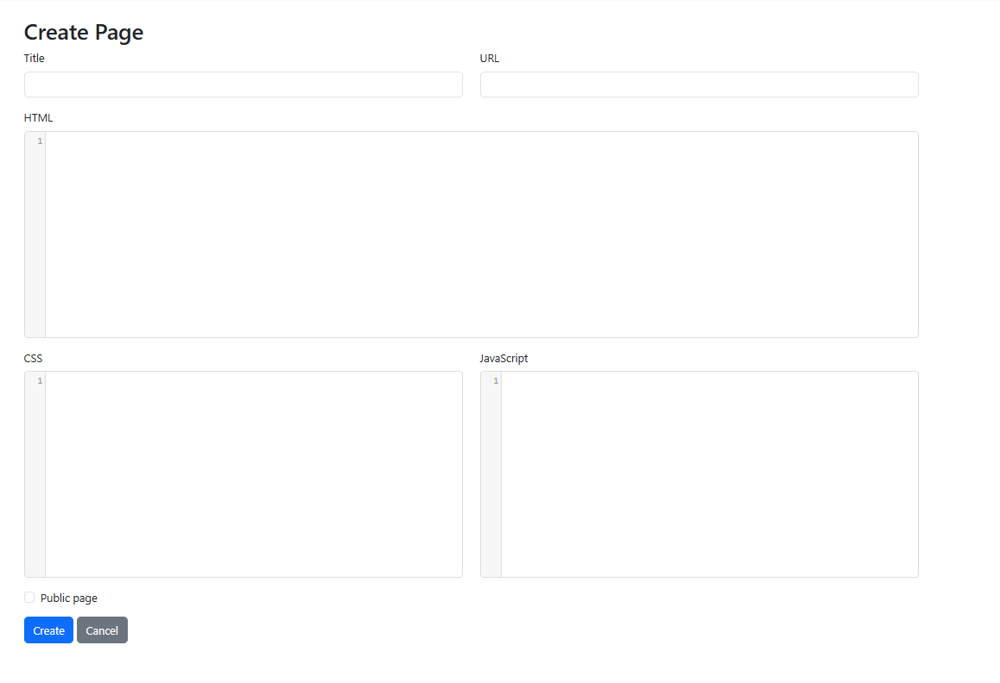
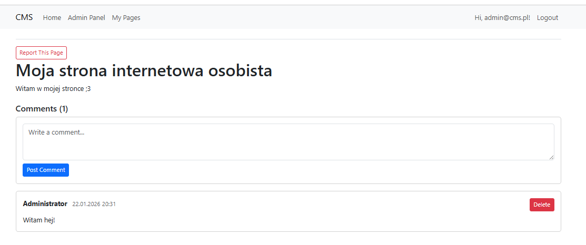
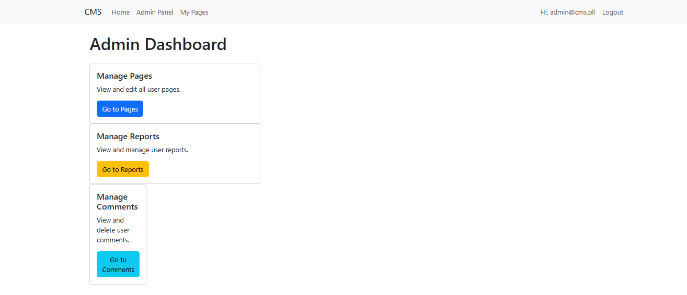
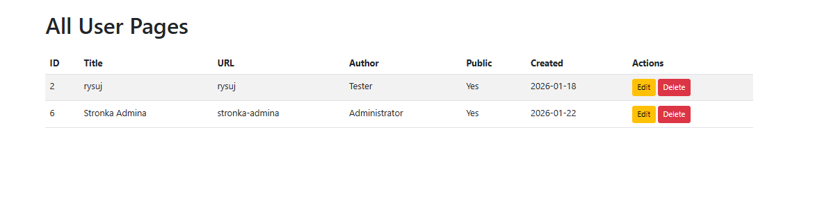
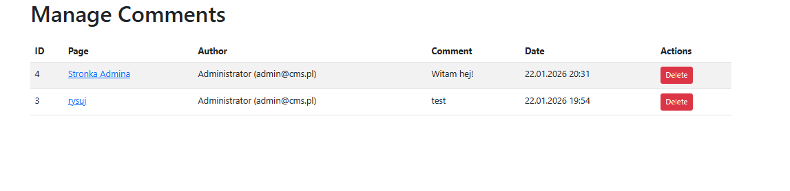
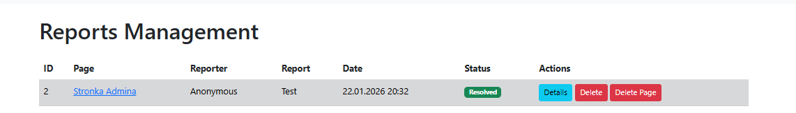

# Pierwsze uruchomienie projektu
```
git clone https://github.com/liitlelenim/UniversityCMSProject

cd ./UniversityCMSProject

# Przywrócenie zależności NuGet
dotnet restore

# Instalacja globalnego  narzędzia dotnet w razie jego rbaku
dotnet tool install --global dotnet-ef

# Utworzenie naszej bazy danych SQLite
dotnet ef database update

dotnet run
```
# Dane do logowania na testowe konto administratorskie
Email: admin@cms.pl

Hasło: Admin123!

# Łańcuch połączeń
Łańcuch połączeń możemy ustawić w pliku ```appsettings.json```
Domyślna wartość to:
``"DefaultConnection": "Data Source=blogsy.db"``. Data source określa nazwe pliku bazy danych SQLite który zostanie utworzony przy migracji.

# Użytkowanie

Aplikacja pozwala użytkownikom na tworzenie własnych stron internetowych.

Po zalogowaniu się użytkownik dostaje możliwość wejścia na podstronę /UserPages. 



Widzimy tam rozpiske stron stworzonych przez użytkownika, które możemy edytować oraz usuwać, oraz przycisk new page pozwalający nam na stworzenie nowej strony.



Formularz pozwala nam na nadanie jej tytułu, wybraniu url oraz tego czy powinna być od początku upubliczniona. Dostajemy do dyspozycji również edytory HTML, CS i Java Script.

Każdy użytkownik ma możliwość wejścia na strone poprzez wskazany url.

Każda strona ma wbudowany system do zgłaszania stron łamiacych regulamin oraz komentowania.

# Uprawnienia adminsitratora

Administrator ma możliwość przeglądania wszystkich stron i komentarzy. Ma możliwość ich usuwania i edycji.




Dostajemy również dostęp do zgłoszeń, oraz proste narzędzia do ich rozwiązywania


# Encje i ich relacje

